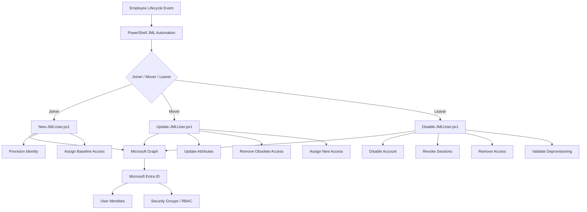

# Microsoft Entra ID JML Identity Lifecycle Automation

An Identity and Access Management (IAM) lab demonstrating an automated **Joiner-Mover-Leaver (JML)** lifecycle using **Microsoft Entra ID, Microsoft Graph, PowerShell, RBAC, and least-privilege access principles**.

The project simulates how an IAM engineer can provision identities, modify access as employees change roles, and securely deprovision users when they leave an organization.

---

## Project Overview

Organizations must ensure that users receive the correct access throughout their employment lifecycle.

This project implements three core IAM processes:

- **Joiner** — Provision a new identity and assign department-based access.
- **Mover** — Update an existing identity and transition access when responsibilities change.
- **Leaver** — Disable the identity, revoke sessions, remove access, and validate deprovisioning.

The workflows use PowerShell and Microsoft Graph to manage identities and security groups in Microsoft Entra ID.

---

## Architecture



Additional architecture details are available in [`docs/architecture.md`](docs/architecture.md).

---

## JML Workflow

### Joiner

The Joiner workflow automates initial identity provisioning.

[`New-JMLUser.ps1`](scripts/joiner/New-JMLUser.ps1)

The workflow:

1. Accepts employee information.
2. Generates identity attributes.
3. Creates the Entra ID account.
4. Maps the employee's department to an RBAC security group.
5. Assigns baseline group-based access.
6. Returns identity information for validation.

Example lifecycle:

```text
New Employee
     ↓
Create Entra ID Identity
     ↓
Configure Employee Attributes
     ↓
Determine Department
     ↓
Assign RBAC Group
     ↓
Validate Provisioning
```

---

### Mover

The Mover workflow handles changes to an employee's role or department.

[`Update-JMLUser.ps1`](scripts/mover/Update-JMLUser.ps1)

The workflow:

1. Retrieves the existing identity.
2. Determines the current department and access.
3. Validates the current and target RBAC groups.
4. Updates department and job-title attributes.
5. Removes obsolete group access.
6. Assigns the new department's RBAC group.
7. Prevents unnecessary RBAC transitions when no department change exists.

Example:

```text
Finance
Financial Analyst
GRP-Finance-Employees
        ↓
     MOVER
        ↓
Engineering
Systems Engineer
GRP-Engineering-Employees
```

---

### Leaver

The Leaver workflow performs controlled identity deprovisioning.

[`Disable-JMLUser.ps1`](scripts/leaver/Disable-JMLUser.ps1)

The workflow:

1. Retrieves the employee identity.
2. Inventories existing group-based access.
3. Disables the Entra ID account.
4. Revokes active sign-in sessions.
5. Removes group memberships.
6. Preserves the identity record for audit/history.
7. Validates the final deprovisioned state.

Final validation verifies:

```text
Account Enabled: False
Remaining Group Memberships: 0
```

---

## RBAC Access Model

Department-based security groups provide baseline authorization.

| Department | Security Group |
|---|---|
| Information Technology | `GRP-IT-Employees` |
| Engineering | `GRP-Engineering-Employees` |
| Finance | `GRP-Finance-Employees` |
| Human Resources | `GRP-HR-Employees` |

This design demonstrates:

- Role-Based Access Control
- Least privilege
- Group-based authorization
- Lifecycle-driven access management
- Removal of obsolete access

See [`docs/access-control-matrix.md`](docs/access-control-matrix.md) for additional details.

---

## Validation Scenario

A lab identity named **Taylor Morgan** was used to validate the complete lifecycle.

### Joiner

```text
Department: Finance
Job Title: Financial Analyst
Group: GRP-Finance-Employees
Account: Enabled
```

**Result: PASS**

### Mover

Taylor was transferred:

```text
Finance → Engineering
Financial Analyst → Systems Engineer
```

Access transitioned:

```text
GRP-Finance-Employees       → Removed
GRP-Engineering-Employees   → Assigned
```

**Result: PASS**

### Leaver

The account was deprovisioned.

Final state:

```text
Account Enabled: False
Remaining Group Memberships: 0
```

**Result: PASS**

Detailed validation documentation is available in [`docs/evidence/README.md`](docs/evidence/README.md).

---

## Repository Structure

```text
entra-jml-identity-lifecycle/
│
├── README.md
│
├── scripts/
│   ├── joiner/
│   │   ├── README.md
│   │   └── New-JMLUser.ps1
│   │
│   ├── mover/
│   │   ├── README.md
│   │   └── Update-JMLUser.ps1
│   │
│   └── leaver/
│       ├── README.md
│       └── Disable-JMLUser.ps1
│
└── docs/
    ├── architecture.md
    ├── access-control-matrix.md
    └── evidence/
        └── README.md
```

---

## Technologies

- Microsoft Entra ID
- Microsoft Graph
- Microsoft Graph PowerShell SDK
- PowerShell
- Git
- GitHub

---

## Security Controls Demonstrated

The project demonstrates practical IAM controls including:

- Identity lifecycle management
- Automated provisioning
- Automated deprovisioning
- Role-Based Access Control (RBAC)
- Least privilege
- Group-based authorization
- Access transition during role changes
- Removal of stale access
- Account disabling
- Session revocation
- Post-change validation
- Error handling
- Safe workflow reruns
- Audit-oriented identity retention

---

## Security Considerations

This repository intentionally excludes:

- Tenant IDs
- Object IDs used during testing
- Passwords
- Authentication tokens
- Client secrets
- Production credentials
- Tenant-specific domains

All identities and employee information shown in the project are fictional lab data.

---

## Skills Demonstrated

This project demonstrates hands-on experience with:

**Identity Engineering**
- Joiner-Mover-Leaver lifecycle design
- Identity provisioning and deprovisioning
- Access lifecycle management
- Identity attribute management

**Authorization**
- RBAC
- Security groups
- Least privilege
- Access remediation

**Automation**
- PowerShell
- Microsoft Graph
- Parameterized scripts
- Error handling
- Workflow validation

**Security Operations**
- Session revocation
- Account disabling
- Access verification
- Audit-oriented identity retention

---

## Project Status

**Completed**

The Joiner, Mover, and Leaver workflows were implemented and validated in a Microsoft Entra ID lab environment.

```text
JOINER  →  MOVER  →  LEAVER
  ✅          ✅          ✅

Provision → Modify Access → Deprovision
```
